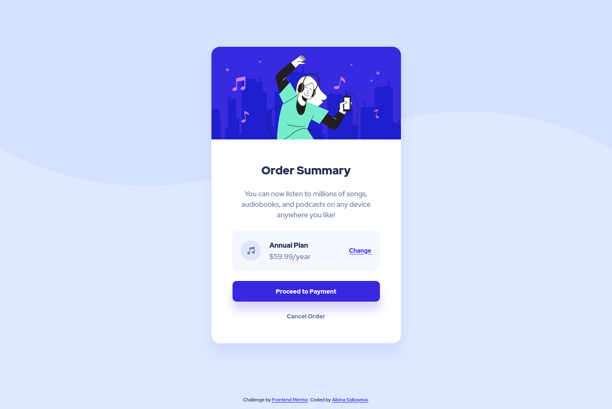

# Frontend Mentor - Order summary card solution

This is a solution to the [Order summary card challenge on Frontend Mentor](https://www.frontendmentor.io/challenges/order-summary-component-QlPmajDUj). Frontend Mentor challenges help you improve your coding skills by building realistic projects. 

## Table of contents

- [Overview](#overview)
  - [The challenge](#the-challenge)
  - [Screenshot](#screenshot)
  - [Links](#links)
- [My process](#my-process)
  - [Built with](#built-with)
  - [What I learned](#what-i-learned)
  - [Useful resources](#useful-resources)
- [Author](#author)

## Overview

### The challenge

Users should be able to:

- See hover states for interactive elements

### Screenshot



### Links

- Solution URL: [https://github.com/albina0104/order-summary-component](https://github.com/albina0104/order-summary-component)
- Live Site URL: [https://albina0104.github.io/order-summary-component/](https://albina0104.github.io/order-summary-component/)

## My process

### Built with

- Semantic HTML5 markup
- CSS custom properties
- Flexbox
- Mobile-first workflow

### What I learned

- I learned the following CSS properties for background positioning:

```css
background-repeat: no-repeat;

background-size: contain;

background-position: center left 15px;
```
- I learned how to add a pressed effect on button click in CSS:

```css
.btn:active, .link:active {
    transform: scale(0.95);
}
```

### Useful resources

- [CSS Backgrounds](https://www.w3schools.com/css/css3_backgrounds.asp) - This W3Schools tutorial helped me to choose the right properties for background positioning.

- [How to add a pressed effect on button click in CSS?](https://www.geeksforgeeks.org/how-to-add-a-pressed-effect-on-button-click-in-css/)

## Author

- Frontend Mentor - [@albina0104](https://www.frontendmentor.io/profile/albina0104)
- GitHub - [albina0104](https://github.com/albina0104)
